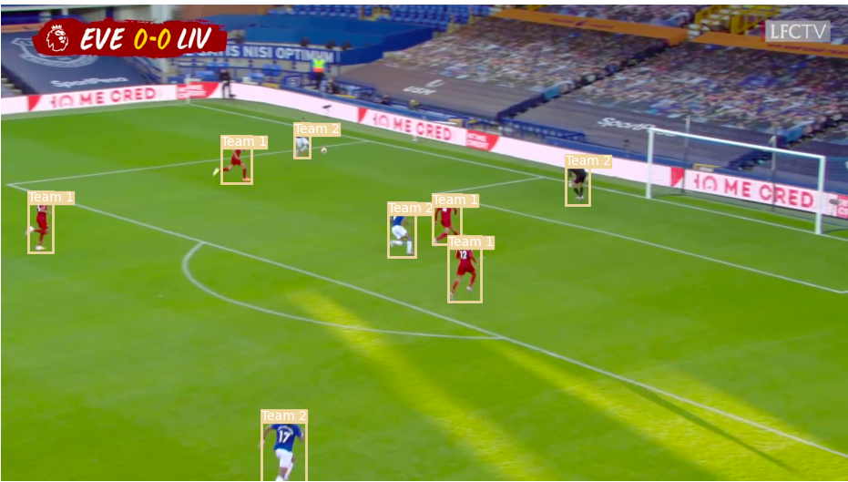

# AutomatedVAR
Yolov5 Folder: https://drive.google.com/drive/folders/1OGVun78Lc8LhvwaS-ValoH8B0v_Apx-o?usp=sharing
YouTube video of our presentation with Demo: https://www.youtube.com/watch?v=HZvvLW67gfk&t=13s

## What is this project and why does Automated Video Assisstant Review (VAR) matter?

- The goal of our project is to create a system that assists manual referees rather than replaces them
- To do this, our model will look at a video of play and figure out whether the player in contention is offsides
- The impact of Automated VAR is massive - many times referees just won't make the correct decision, and this costs teams games. 
- Mbappe's offside goal against Spain was ruled as valid when it should've been ruled for offsides: check out this meme!
- Luckily our program ended up detecting that Mbappe was offsides (notice how Mbappe's line is ahead of the defender's line)

Input(mp4 but since I can't attach video in ReadME here's a jpg input extracted from mp4):

Output:

## What is the novelty in our project?

  For many testcases, we have automated more of the VAR process than ever before:
  - Our input is an mp4 file rather than just a jpeg, meaning that our program needs to also find the specific frame in the video to analyze for offsides
  - Our input only uses one broadcast view as opposed to other models that required the use of multiple broadcast views
  - From the input of the mp4 file to the output of the decision, every part of our process is automated except selecting which player is being passed to

## So how did we do this?

### Step 1: Tracking the Players and the Ball

#### Why did we do this?
- We need to find the exact frame in the video right where the attacking player passes the ball- since that's the frame that's analyzed in tradition offsides analysis
- To do this, we need to track the coordinates of the player and the ball to see when the ball leaves the attacking players feet

#### What did we do?
- To track the players, we used the COCO model from yolov5 that can detect people, and this model worked well
- The COCO model claimed it could recognize soccer balls, but it didn't recognize any ball in almost all our test cases
- This is likely because the soccer balls in our test cases are too small to detect
- Thus, we used Darknet to create a model that could recognize soccer balls
- We annotated over 700 images and trained our model on TJHSST's strong CPU to get this custom model to work

### Step 2: Picking the Frame to Analyze

#### Why did we do this?
- Great! We got past step 1 :) Now that we can track the players and the ball, we can figure out when the ball leaves the players foot.

#### How did we do this
- This was the most straightforward step, our model just found the frame where the distance between the passing player and the ball became more than minimal. 
- If the distance didn't decrease after a few steps, that means the ball truly had left the player's foot.

### Step 3: Seperating Players by team

#### Why did we do this?
- We need to figure out the last defender on the opposing team, since his position will determine whether the attacker is offsides
- This proved to be one of the hardest parts of the project

#### How did we do this?
- First, we performed Image Segmention on each of the identified players (show below). This ensured that once we took the average RGB values of the player's jersey, the amount of pixels that aren't part of the jersey is minimized.

Before:

After(pixels in black aren't included in RGB calculations):

- Then we took the average RGB value of each player, and used k-means to seperate these players into different clusters. 
- We originally set the number of clusters to 2, before realizing that we needed to include the referee and goalkeeper too and changed the number of clusters. The support vector machines we used to cluster the players no longer worked in groups of more than 2, so we switched to k-means.

k-means with 2 clusters:

Final k-means:

### Step 4: Figuring out the Two Players in Contention for Offsides

#### Why did we do this?
- Well to figure out whether a player is offsides, we need to find both the last defender and the player that could be offside

#### How did we do this?
- Well now that we know which team each player represents, we find the last defender of the defending team
- We do this by finding the player of the defending team closest to the goal line (perpendicular distance, and goal line is identified in next step)
- As for the player that could be offsides, the user has to manually input which player they'd like to analyze for offsides

### Step 5: Identifying the Goal-line

#### Why did we do this?
- The offsides lines shown in sample output are parallel to the goal-line(in 3D coordinates). So to create these lines, we need to identify the goal-line

#### How did we do this?
- We found an algorithm called hough-line transformations that is used to detect straight lines (peep image below)
- Then to pick from these lines- we used two factors to pick the best line:
- How long is the line (The longer, the better)?
- How perpendiular is the line relative to the players (The more perpendiular, the better)?

Result!:

Line with score of .14:

Line with score of .69 (this is the actual goal line):

### Step 6: Drawing the Offsides Lines

#### Why did we do this?
- Because that's the entire point of our project :) Once we draw these lines, we can determine whether the attacking player is offsides.

#### How did we do this?
- This was harder than anticipated- we first just tried drawing these lines parallel to the goal line in 2D, but then out image looked like this.

- Instead, we needed to tilt the lines propotionally to how far away it is from the goal line: the further away it is, the more tilted the line is.
- Our function for this definitely isn't completely accurate, but bar the super close call test cases it does pretty well.

### Future Work/Limitations
- We could create a frontend for users to enter testcases and give feedback on our model.
- As much as it sucks to say, we should sacrifice our novelty of using only one broadcast view, because using multiple broadcast views means that we could use 3D coordinates to map the positions of the players and the ball as opposed to 2D coordinates, which would lead to more accuracy. 
- Our model requires that the goal-line needs to be clearly in the frame of the video, or else we can't draw the offside lines parallel to the players.
- We could also optimize the run-time of our model so that it could work efficiently when needed to be used during a game.

# Thanks for reading through!!!!!!

